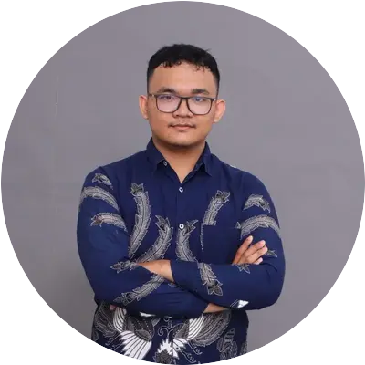

Hi, I'm **Anjasfedo** — a Software Engineer from Bengkulu, Indonesia.

I build software systems that are scalable, efficient, and ready for real-world use. My work spans full-stack web development, cloud architecture, mobile apps, and machine learning — I enjoy the full spectrum from backend APIs to pixel-perfect frontends.

Currently I'm balancing roles as a Software Engineer at Perseverance Technology Co., Ltd., building desktop software with Python and C++ and integrating ML models into production features, alongside full-stack development at Aranus Technology.

I've worked across the stack at internships in cloud architecture and DevOps at Elitery, frontend engineering at Langgeng Inovasi Teknologi, and as an Assistant Lecturer at Universitas Bengkulu teaching framework programming and web development.

I'm a Cloud Computing graduate of Bangkit Academy (Google, Tokopedia, Gojek, & Traveloka) and an AWS Bootcamp alum. My tech toolkit includes TypeScript, Python, Go, Laravel, Next.js, React, Astro, Docker, and cloud platforms like AWS, GCP, and Cloudflare.

When I'm not coding, I'm into cloud tech, open source, photography, and coffee.
